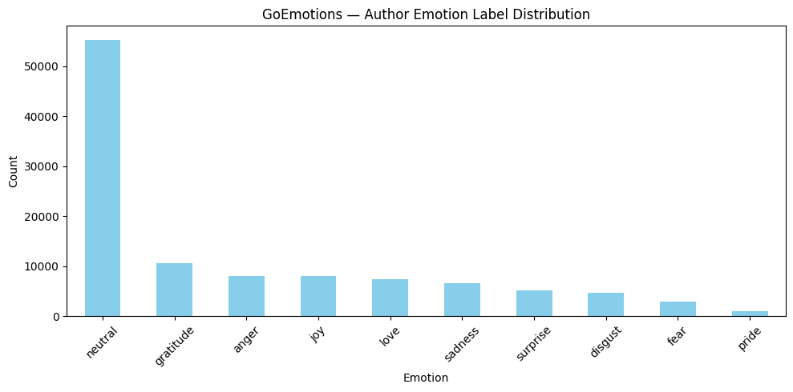
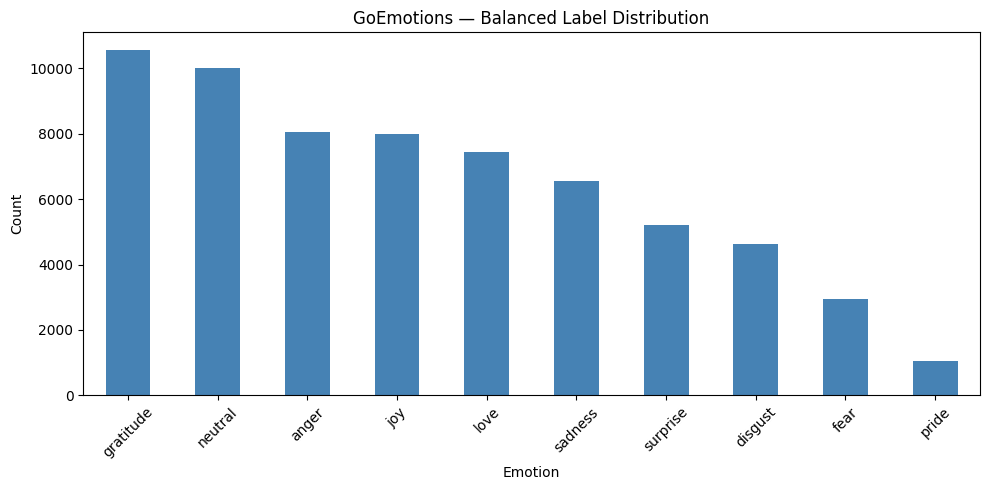
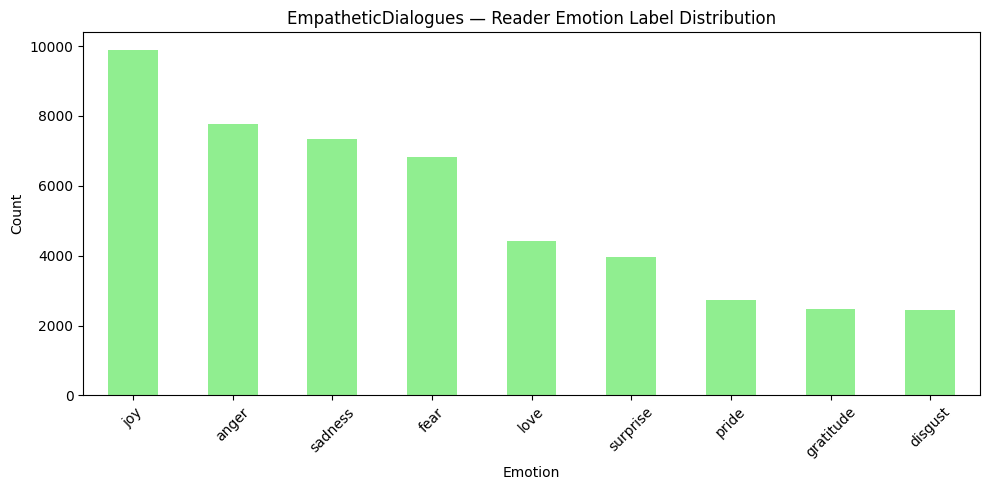
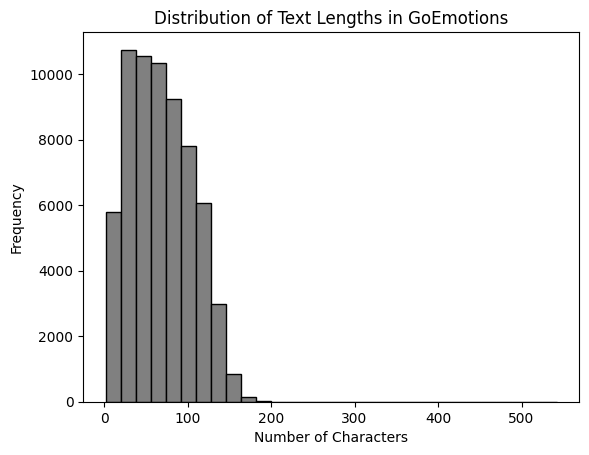
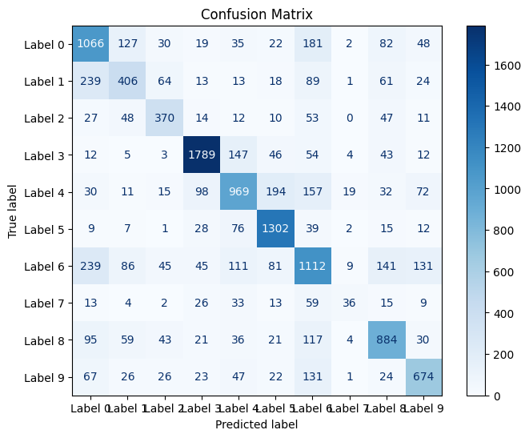
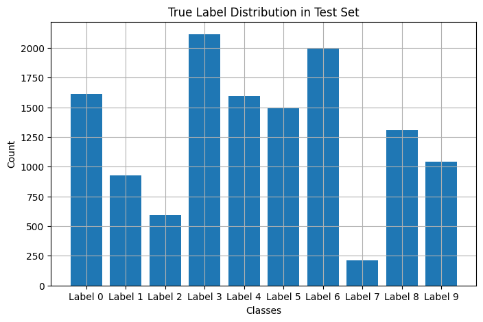
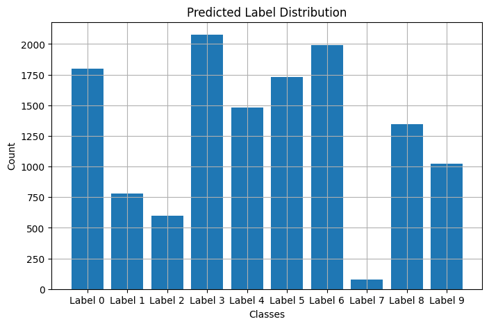

# The Echo Room — Dual-Lens Emotion Interpretation with LLMs

**Goal:** Online communication is quick, global, and often stripped of the tone, body language, and context that help us understand each other. A heartfelt message might be read as sarcasm, or a joke as hostility. These misinterpretations can lead to misunderstandings, damaged relationships, and even online conflicts. **The Echo Room** aims to address this problem by modeling both the **author’s intended emotion** and the **reader’s perceived emotion**, helping reveal where and how emotional meaning shifts between sender and receiver.

---

## What's Built (Scope)

- A **10-class emotion classifier** trained on **GoEmotions** (author perspective) using a modern transformer: `BAAI/bge-small-en`.  
- A **shared-label mapping** that aligns **EmpatheticDialogues** (reader perspective) to the same 10 emotions for analysis and future modeling.  
- Clear EDA, label balancing (neutral cap), training, and evaluation with confusion matrix + distributions.

> **Note:** In this submission for the project we trained **one model** (author perspective). The reader-side model is planned as next work and is supported by the shared-label mapping and EDA included here.

---

## Datasets

- **GoEmotions** (Google): Reddit comments with fine-grained emotions → used to train the classifier.  
- **EmpatheticDialogues** (FAIR): Emotion-labeled dialog utterances → used for reader-perspective EDA and label alignment.

**Shared 10 emotions used across both:** `joy, anger, sadness, fear, surprise, disgust, love, gratitude, neutral, pride`.

---

## Feasibility — Data Understanding & Label Alignment

- Filtered both datasets to the 10 shared emotions.  
- Mapped EmpatheticDialogues `context` → shared emotions (e.g., *joyful/excited/content → joy*, *afraid/terrified/apprehensive → fear*, etc.).  
- Noted heavy **class imbalance** (especially *neutral* in GoEmotions) and set a **cap of 10,000** neutral examples.

**Author label distribution (before balancing):**  
  
*GoEmotions — Author Emotion Label Distribution.*

**Balanced author labels (after capping neutral):**  
  
*GoEmotions — Balanced Label Distribution.*

**Reader label distribution (for alignment/EDA):**  
  
*EmpatheticDialogues — Reader Emotion Label Distribution.*

**Text length distribution (tokenization planning):**  
  
*Distribution of Text Lengths in GoEmotions.*

---

## Prototype — Modeling Setup

- **Model:** `BAAI/bge-small-en` with a **classification head** (10 labels).  
- **Tokenization:** max length 128, truncation + padding.  
- **Split:** stratified 80/20 train/test (random_state=42).  
- **Class encoding:** `LabelEncoder`.  
- **Training:** 1 epoch (Colab Free), **batch size 2** with **gradient accumulation** to fit memory limits.  
- **Saved Artifacts:** model and tokenizer (zip export).

---

## Final — Results

**Run details (Colab Free):** ~**5h 05m** for 1 epoch.  
**Loss:** Train **1.0617**, Eval **1.0211**  
**Metrics (test, weighted):** **Accuracy 66.75%**, **Precision 66.36%**, **Recall 66.75%**, **F1 66.33%**

**Confusion Matrix:**  

**True vs. Predicted Label Distributions:**  
  

**Takeaways (author model):**
- Performance is solid for a compact model under tight memory.  
- Most confusion occurs among semantically close emotions (e.g., *joy* vs. *gratitude*, *anger* vs. *disgust*).  
- Class balancing reduced neutral dominance and improved per-class learning.

---

## What This Means 

- We can predict an **author’s emotion** with ~**67%** accuracy across 10 classes.  
- We set the foundation for a **reader-perception** model by aligning labels and analyzing reader distributions.  
- Together, these enable measuring **author vs. reader divergence**—the core of the Echo Room vision. This is the first step toward tools that could help reduce misunderstandings and improve emotional clarity in online spaces.

---

## Next Steps

1. **Train the reader model** on the aligned EmpatheticDialogues set (same 10 classes).  
2. Move from **single-label** to **multi-label** (some texts carry multiple emotions).  
3. Add a small **divergence analysis** module: compare author vs. reader predictions.  
4. Optional demo (Gradio/Streamlit) once both sides are trained.

---

## Reproduce This Work

1. Open **Google Colab**.  
2. Upload these files to your Colab working directory:
   - `go_emotions_dataset.csv`
   - `empatheticdialogues.tar.gz`
3. Open and run the notebook:
   - `ZewdieLLM_Prototype.ipynb` (end-to-end: cleaning → training → evaluation)
4. Follow cells in order to:
   - Apply shared-label mapping & balancing
   - Train the model
   - Evaluate (metrics + plots)
   - Save/export the model

**Environment**
- Python 3.10+ (Colab)
- `transformers==4.37.2`, `accelerate==0.27.2`, `peft==0.10.0`
- PyTorch, scikit-learn, pandas, matplotlib

---

## Repository Contents

- `README.md` (this file)  
- `ZewdieLLM_Prototype.ipynb` (implementation)  
- `ZewdieLLM_Feasibility.pdf` (early exploration)  
- Figures used in this README:
  - `goemotions_author_distribution.png`  
  - `goemotions_balanced_distribution.png`  
  - `empathetic_reader_distribution.png`  
  - `text_length_distribution.png`  
  - `confusion_matrix.png`  
  - `true_label_distribution.png`  
  - `predicted_label_distribution.png`  
- `UTA-DataScience-Logo.png`

---

## Citations

- GoEmotions Dataset — Hugging Face  
- EmpatheticDialogues Dataset — Hugging Face  
- `BAAI/bge-small-en` — Model Card  
- Hugging Face Transformers Docs

---
